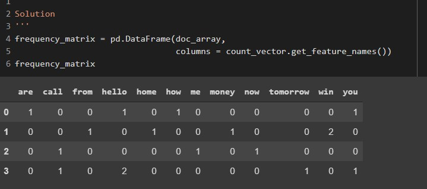
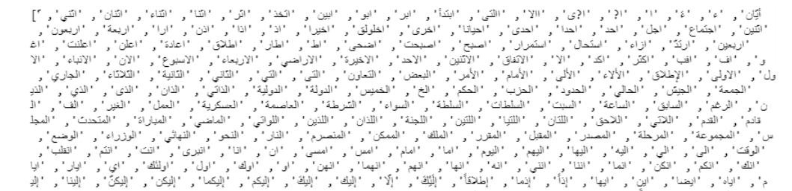
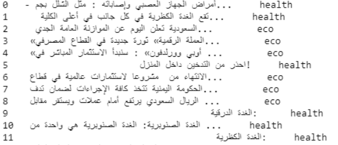
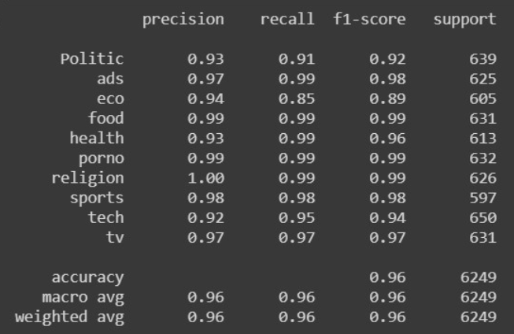
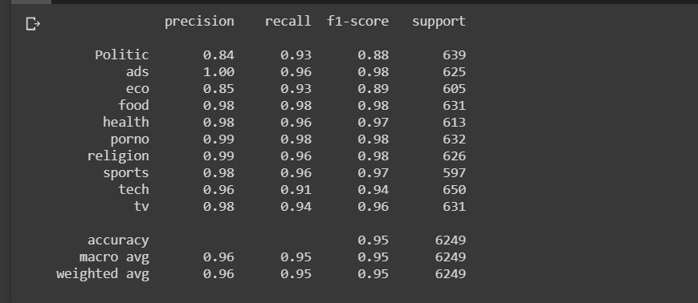

# post classification 

post classifier using Bag of words technique to classify posts in social media network into lots of categorieslike  politics, economics, sport, religion, technology, TV, ads, foods, health, and porno

dataset contains 25,000 posts collected from Facebook and classified into ten categories

---
* style project

<p width = 400 , height = 300>
  
</p>

---

[image1]: ./images/Captureautomata.PNG "Data Image "


### Table of Contents

In this section you will know More bout this interesting project :smiley:

- [overview](#overview)
- [Prerequisites](#Prerequisites)
- [Installing](#Installing)
- [steps of this project](#steps_of_this_project)
- [Description_of_this_data](#Description_of_this_data)
- [Running the tests](#Running_the_tests)
- [Deployment](#Deployment)
- [accuracy](#accuracy)
- [stemming](#stemming)
- [Built With](#Built_With)
- [Contributing](#Contributing)
- [Versioning](#Versioning)
- [Authors](#Authors)
- [License](#License)


---

## overview

Classification is a really hard problem because if you need a good result  you must pass certain steps from data you use until what technique you use . The most important part is the dataset you use .

No one takes care of grammar when he speaks or writes neither in english nor in arabic that’s the meaning of “Slang” . 

we tried our moel to be robust so we used slang language collected from facebook .

in the next steps we would show steps from pass tokens to CountVectorizer and why using naive bayes  reached a good results of 97 % , and why using  modified finite state Automaton Tashaphyne 0.3.4.1 didn’t improve our result .
 
---
### Prerequisites

* basic acknowledge of tokenization and parser
* basic acknowledge about Naive Bayes Theorem
* python 
* numpy and pandas
* basic acknowledge Bag of Words
* scikit-learn

---

### Installing

 you should install some libraries to use it in data processing and build model 

```
   import pandas as pd
   import codecs
   import string
   from sklearn.model_selection import train_test_split
   from sklearn.feature_extraction.text import CountVectorizer
   from sklearn.preprocessing import LabelEncoder
   from tashaphyne.stemming import ArabicLightStemmer
   from sklearn.metrics import classification_report
   import nltk
   nltk.download('stopwords')
   from nltk.corpus import stopwords


   
```

---

### steps of this project

* Understanding our dataset
* Data Preprocessing
* Bag of words
* Implementing Bag of Words in scikit-learn
* Training and testing sets
* Naive Bayes implementation using scikit-learn
* Evaluating our model

---

### Description of this data

dataset contains 25,000 posts collected from Facebook and classified into ten categories, politics, economics, sport, religion, technology, TV, ads, foods, health, and porno

<p align="center" width = 200>
  
</p>

---

### Understanding our dataset 

We will  use a dataset originally compiled and posted on the Machine Learning website search has a very good collection of datasets for experimental research purposes. If you're interested, you can review the abstract and the original data file on the wep site.

<p align="center">
  
</p>


---
### Data Preprocessing

we will show example of technique we used at data of sms classification of ham and spam ,  After that we would go through our data .You might be wondering why do we need to do this step? The answer to this lies in how scikit-learn handles inputs.

Scikit-learn only deals with numerical values and hence if we were to leave our label values as strings, scikit-learn would do the conversion internally(more specifically, the string labels will be cast to unknown float values).

Our model would still be able to make predictions if we left our labels as strings but we could have issues later when calculating performance metrics, for example when calculating our precision and recall scores. Hence, to avoid unexpected 'gotchas' later, it is good practice to have our categorical values be fed into our model as integers. 


```
 dataset.predection.map({0:'Politic',1:'ads',2:'eco',3:'food',4:'health',5:'porno',6:'religion',7:'sports',8:'tech',9:'tv'})

```
---
### Bag of words

What we have here in our data set is a large collection of text data (5,572 rows of data). Most ML algorithms rely on numerical data to
be fed into them as input, and email/sms messages are usually text heavy.

Here we'd like to introduce the Bag of Words(BoW) concept which is a term used to specify the problems that have a 'bag of words' ora collection of text data that needs to be worked with. The basic idea of BoW is to take a piece of text and count the frequency of the 
words in that text. 

It is important to note that the BoW concept treats each word individually and the order in which the words occur does not matter.

Using a process which we will go through now, we can covert a collection of documents to a matrix, with each document being a row and each word(token) being the column, and the corresponding (row,column) values being the frequency of occurrance of each word or token in
that document.

### steps of Bag of words

* Convert all strings to their lower case form.
```
documents = ['Hello, how are you!',
             'Win money, win from home.',
             'Call me now.',
             'Hello, Call hello you tomorrow?']

lower_case_documents = []
for i in documents:
    lower_case_documents.append(i.lower())
print(lower_case_documents)

```
- output 
<p width = 300 , height = 20>
  
</p>


* Removing all punctuation

Remove all punctuation from the strings in the document set. Save them into a list called 'sans_punctuation_documents'.

```
sans_punctuation_documents = []
import string

for i in lower_case_documents:
    sans_punctuation_documents.append(i.translate(str.maketrans('', '', string.punctuation)))
print(sans_punctuation_documents)

```
- output
<p width = 300 , height = 20>
  
</p>

* Tokenization
Tokenizing a sentence in a document set means splitting up a sentence into individual words using a delimiter. The delimiter specifies

what character we will use to identify the beginning and the end of a word(for example we could use a single space as the delimiter for

identifying words in our document set

```
preprocessed_documents = []
for i in sans_punctuation_documents:
    preprocessed_documents.append(i.split(' '))
print(preprocessed_documents)

```

- output
<p width = 300 , height = 20>
  
</p>

* Count frequencies

Now that we have our document set in the required format, we can proceed to counting the occurrence of each word in each document of 

the document set. We will use the Counter method from the Python collections library for this purpose.

Counter counts the occurrence of each item in the list and returns a dictionary with the key as the item being counted and the 

corresponding value being the count of that item in the list. 

```
for i in preprocessed_documents:
    frequency_counts = Counter(i)
    frequency_list.append(frequency_counts)
pprint.pprint(frequency_list)

```
- output
<p width = 300 , height = 50>
  
</p>


### Implementing Bag of Words in scikit-learn

```
from sklearn.feature_extraction.text import CountVectorizer
count_vector = CountVectorizer()
count_vector.fit(documents)
count_vector.get_feature_names()
doc_array = count_vector.transform(documents).toarray()

```
- output
<p width = 300 , height = 70>
  
</p>


- frequency matrix 
<p width = 300 , height = 50>
  
</p>

---


### Naive Bayes

Bayes Theorem is one of the earliest probabilistic inference algorithms. It was developed by Reverend Bayes (which he used to try and infer the existence of God no less), and still performs extremely well for certain use cases.

It's best to understand this theorem using an example. Let's say you are a member of the Secret Service and you have been deployed to protect the Democratic presidential nominee during one of his/her campaign speeches. Being a public event that is open to all, your job is not easy and you have to be on the constant lookout for threats. So one place to start is to put a certain threat-factor for each person. So based on the features of an individual, like the age, sex, and other smaller factors like whether the person is carrying a bag, looks nervous, etc., you can make a judgment call as to whether that person is a viable threat.

This is the 'Naive' bit of the theorem where it considers each feature to be independent of each other which may not always be the case and hence that can affect the final judgement.

In short, Bayes Theorem calculates the probability of a certain event happening (in our case, a message being spam) based on the joint probabilistic distributions of certain other events (in our case, the appearance of certain words in a message). We will dive into the workings of Bayes Theorem later in the mission, but first, let us understand the data we are going to work with.

---

### why Naive Bayes algorithm is the best ??

Naive Bayes are mostly used in natural language processing (NLP) problems. Naive Bayes predict the tag of a text. They calculate the probability of each tag for a given text and then output the tag with the highest one.

One of the major advantages that Naive Bayes has over other classification algorithms is its ability to handle an extremely large number of features. In our case, each word is treated as a feature and there are thousands of different words. Also, it performs well even with the presence of irrelevant features and is relatively unaffected by them. The other major advantage it has is its relative simplicity. Naive Bayes' works well right out of the box and tuning it's parameters is rarely ever necessary, except usually in cases where the distribution of the data is known. It rarely ever overfits the data. Another important advantage is that its model training and prediction times are very fast for the amount of data it can handle. All in all, Naive Bayes' really is a gem of an algorithm!


[If you want more use this link](https://www.geeksforgeeks.org/applying-multinomial-naive-bayes-to-nlp-problems/#:~:text=Naive%20Bayes%20are%20mostly%20used,tag%20with%20the%20highest%20one.)
---
### Naive Bayes implementation using scikit-learn

```
from sklearn.naive_bayes import MultinomialNB
naive_bayes = MultinomialNB()
naive_bayes.fit(training_data,y_train)

```
---

### stop of wards 

```
zstop= pd.read_csv('/content/drive/My Drive/Colab Notebooks/nlp/zstopword - Sheet1.csv',header=None ,encoding="utf-8")
preprocessed_documents = []
for i in zstop[0]:
    preprocessed_documents.append(i)
print(preprocessed_documents)
len(preprocessed_documents)

```
- output
<p  width = "100" , height = "30">
  
</p>


### Evaluating our model

```
predictions = naive_bayes.predict(testing_data)

print(predictions)

```
- output

|--------------------------input-------------------------|---------label--------|

<p  width = 300 , height = 20>
  
</p>


---

### accuracy
```
from sklearn.metrics import accuracy_score, precision_score, recall_score, f1_score

```
* accuracy with no stop wards

<p align = "center" ,width = "100" , height = "100">
  
</p>

* accuracy with nltk _stop_words_only

<p align = "center" ,width = "100" , height = "100">
  
</p>

* accuarcy using nltk stop wards and using stemming

<p align = "center" ,width = "100" , height = "100">
  
</p>

* accuarcy using big stop words of nltk and mine 1973 total length

<p align = "center" ,width = "100" , height = "100">
   
</p>


* We can see that after using the long stop words list of 1973  the accuracy decreased so why ..? 

The reason for that is the supplied list of stop words is for non-slang language so that doesn't improve anything . 
And also stemming decreased the accuracy from 97 % to 96 % ! ….. ? 

And that’s because stemming is mostly used in non-slang language also and most of the words that’s used in arabic does not belong to the language . 


### stemming

using Tashaphyne libraries [here](https://pypi.org/project/Tashaphyne/)

* about this libraries

    Tashaphyne is an Arabic light stemmer and segmentor. It mainly supports light stemming (removing prefixes and suffixes) and give all

    possible segmentations. It use a modified finite state Automaton which allow to generate all segmentations.

    It offers stemming and root extraction at the same time unlike Khoja stemmer, ISRI semmer, Assem stemmer, Farasa stemmer.

    Tashaphyne comes with default prefixes and suffixes, and accept the use of customized prefixes and suffixes list, which allow it to

    handle more aspect, and make customized stemmers without changing code.

---

* Features

   1- Arabic word Light Stemming.

   2- Root Extraction.

   3- Word Segmentation

   4- Word normalization

   5- Default Arabic Affixes list.

---

* Applications

   1- Stemming texts

   2- Text Classification and categorization

   3- Sentiment Analysis

   4- Named Entities Recognition

---

* Installation

```
pip install tashaphyne

```
---

### Deployment

```
this project we deploy it on herouko you can try it via link bellow 
```

* [postclassify model](https://posts-classification.herokuapp.com/) 

---

### dataset

dataset from our paper research 
[paper](https://www.researchgate.net/publication/322704992_Building_Online_Social_Network_Dataset_for_Arabic_Text_Classification?fbclid=IwAR2pvpBJ42yM1s6YnvGkb-kyD1XLh2HviwWDF0muqEgJL9dB0eo73vqIkCU)

## Authors

* 💕 team 

---

[Back To The Top](#README.md) :point_up:

